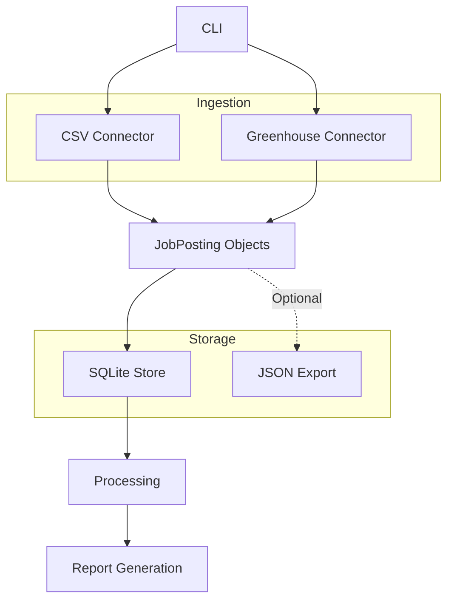

```mermaid
flowchart TD

    CLI[CLI]

    subgraph INGEST[Ingestion]
        CSV[CSV Connector]
        GH[Greenhouse Connector]
    end

    JOBS[JobPosting Objects]

    subgraph STORAGE[Storage]
        SQL[SQLite Store]
        JSON[JSON Export]
    end

    PROCESS[Processing]
    REPORT[Report Generation]

    CLI --> CSV
    CLI --> GH

    CSV --> JOBS
    GH --> JOBS

    JOBS --> SQL
    JOBS -. Optional .-> JSON

    SQL --> PROCESS

    PROCESS --> REPORT
```