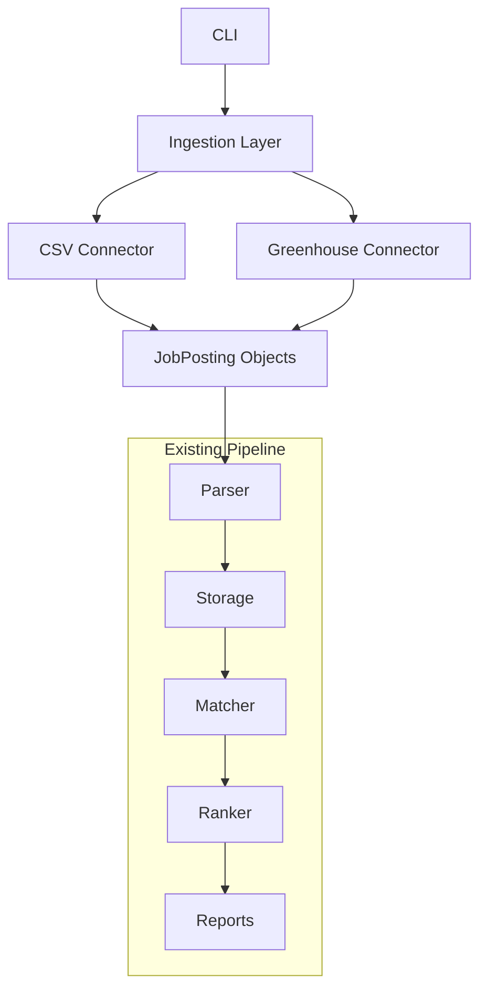

```mermaid
flowchart TD
    CLI["CLI"]
    INGEST["Ingestion Layer"]

    CSV["CSV Connector"]
    GH["Greenhouse Connector"]

    JOBS["JobPosting Objects"]

    subgraph PIPELINE["Existing Pipeline"]
        PARSER["Parser"]
        STORAGE["Storage"]
        MATCHER["Matcher"]
        RANKER["Ranker"]
        REPORTS["Reports"]

        PARSER --> STORAGE
        STORAGE --> MATCHER
        MATCHER --> RANKER
        RANKER --> REPORTS
    end

    CLI --> INGEST

    INGEST --> CSV
    INGEST --> GH

    CSV --> JOBS
    GH --> JOBS

    JOBS --> PARSER
```